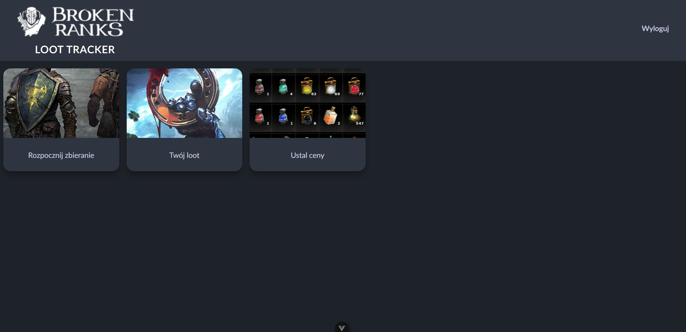
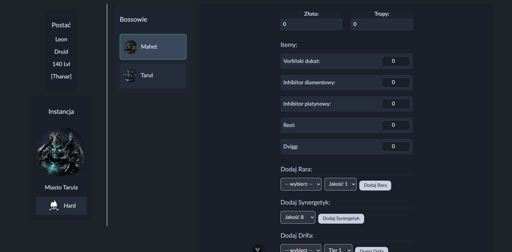
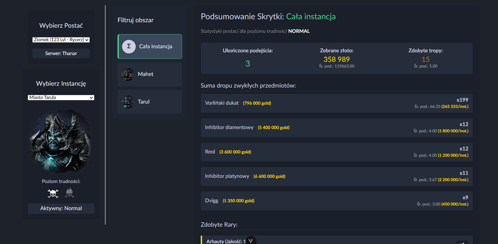
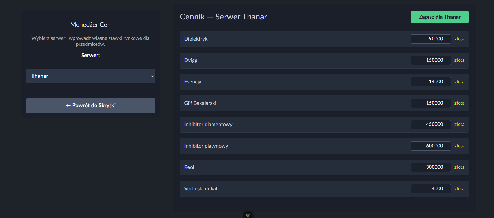

<div>
  <a href="https://github.com/PiotrSzkaradek1/loot-tracker">
    
  </a>
</div>

# Loot Tracker

Loot Tracker is a web application for tracking loot drops, characters, and bosses in an MMORPG game Broken Ranks. It allows users to register, log in, add characters, select bosses, record loot, and view loot statistics.

## Features

- User registration and authentication (JWT)
- Add and manage characters within the application, which represent players in-game characters
- Select bosses and difficulty levels, based on your choice of dungeon in the game
- Record loot drops (items, gold, rars, synergetics, drifs, etc.)
- View loot statistics and summaries per character and boss

## User interface preview

Navigation board
<a href="https://github.com/PiotrSzkaradek1/loot-tracker">
  
</a>

Loot saving panel 
<a href="https://github.com/PiotrSzkaradek1/loot-tracker">
  
</a>

Stash summary
<a href="https://github.com/PiotrSzkaradek1/loot-tracker">
  
</a>

Price setting panel
<a href="https://github.com/PiotrSzkaradek1/loot-tracker">
  
</a>

## Technologies

- **Node.js (Express.js)**
- **JWT**
- **PostgreSQL**
- **Vue.js**
- **Docker & Docker compose**
- **Git**


## Requirements

- Node.js >= 20
- npm >= 11
- Docker & Docker Compose

## Running with docker (Recommended)

1. Clone repository.
```sh
git clone https://github.com/PiotrSzkaradek1/loot-tracker
cd loot-tracker
```

2. Build and run containers

For running application first time on your machine after cloning always use the build flag (app may need up to few minutes to build):
```sh
docker compose up --build
```
For every consecutive start use:
```sh
docker compose up
```

3. The application services will map to the following local ports:

- Frontend Interface: http://localhost:5137

- Backend REST API: http://localhost:3000

4. Running without docker

- Backend:
```sh
cd backend
npm install
npm start
```

- Frontend:
```sh
cd frontend
npm install
npm run dev --host
```

5. Notes
Make sure you have PostgreSQL running and configured if running backend without Docker.
JWT tokens are required for authentication.
Frontend communicates directly with backend API, make sure backend is running first.